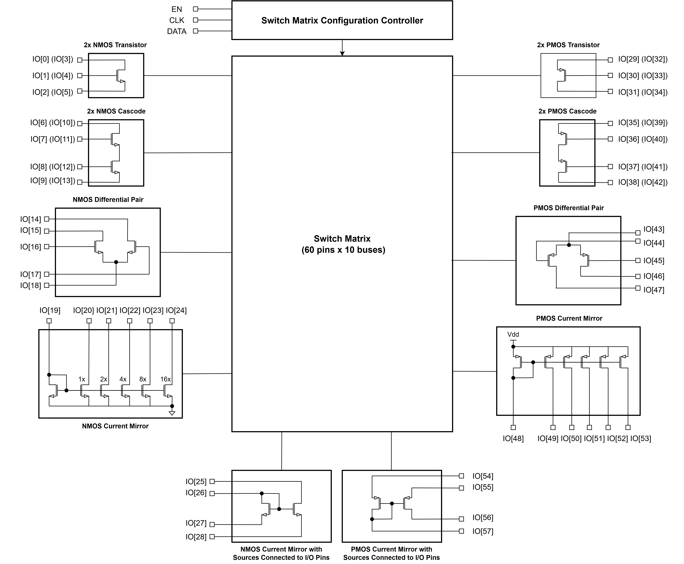

# IEEE SSCS Chipathon 2025 - MOSbius Track: Team FPTA

## Project Proposal: Design of Amplifier Circuits using the MOSbius Architecture

  
  
  
  

---

## Introduction and Motivation
To support hands-on learning and deepen intuition in analog circuit design for electrical engineering students and hobbyists learning analog IC design, we propose a MOSbius-based Field Programmable Transistor Array (FPTA) architecture that enables reconfiguration and testing of multiple amplifier topologies. By dynamically switching transistor-level connections, users can explore and compare different analog amplifier designs from simple single stage amplifiers such as common source and cascode to more complex amplifiers such as a single stage OTA, two stage OTA, telescopic cascode amplifier, and folded cascode amplifier. The illustration below presents a few of these stages.

---

## Project Datasheet

#### Overview
The block diagram below presents a high level overview of the chip design with its required sub-blocks. In order to be able to construct the desired amplifier circuits, the following blocks are required:

* 2 × NMOS Transistors
* 2 × NMOS Cascode Stage
* 1 × NMOS Differential Pair Stage
* NMOS Current Mirror (1×, 2×, 4×, 8×, 16×)
* NMOS Current Mirror with Source Connected to Pin (1×)
* 2 × PMOS Transistors
* 2 × PMOS Cascode Stage
* 1 × PMOS Differential Pair Stage
* PMOS Current Mirror (1×, 2×, 4×, 8×, 16×)
* PMOS Current Mirror with Source Connected to Pin (1×)
* Switch Matrix for Reconfiguration (60 pins × bus-width of 10)

#### General Chip Specifications
*Note: Specifications for the individual blocks will be determined after initial simulations
| Parameter | Value | Unit |
| :---: | :---: | :---: |
| Technology Node | gf180mcuD | - |
| Supply Voltage | 3.3 | V |
| Input Voltage Range | 0 - 3.3 | V |

#### Pin Out
| No. | Pin | Type | Description |
| :---: | :---: | :---: | :---: |
| 1 | VDD | Power | Power Supply (3.3V) |
| 2 | VSS | Power | Power Supply Ground |
| 3 | EN | Digital Input | Switch Matrix Enable |
| 4 | CLK | Digital Input | Switch Matrix Clock |
| 5 | DATA | Digital Input | Switch Matrix Data |
| 6 - 8 | IO[0] - IO[2] | Analog I/O | NMOS Drain, Gate, Source |
| 9 - 11| IO[3] - IO[5] | Analog I/O | NMOS Drain, Gate, Source |
| 12 - 15 | IO[6] - IO[9] | Analog I/O | NMOS Cascode Stage Pins |
| 16 - 19 | IO[10] - IO[13] | Analog I/O | NMOS Cascode Stage Pins |
| 20 - 24 | IO[14] - IO[18] | Analog I/O | NMOS Differential Pair Pins |
| 25 - 30 | IO[19] - IO[24] | Analog I/O | NMOS Current Mirror Pins |
| 31 - 34 | IO[25] - IO[28] | Analog I/O | NMOS Current Mirror with Sources Connected to I/O Pins |
| 35 - 37 | IO[29] - IO[31] | Analog I/O | PMOS Drain, Gate, Source |
| 38 - 40| IO[32] - IO[34] | Analog I/O | PMOS Drain, Gate, Source |
| 41 - 44 | IO[35] - IO[38] | Analog I/O | PMOS Cascode Stage Pins |
| 45 - 48 | IO[39] - IO[42] | Analog I/O | PMOS Cascode Stage Pins |
| 49 - 53 | IO[43] - IO[47] | Analog I/O | PMOS Differential Pair Pins |
| 54 - 59 | IO[48] - IO[53] | Analog I/O | PMOS Current Mirror Pins |
| 60 - 63 | IO[54] - IO[57] | Analog I/O | PMOS Current Mirror with Sources Connected to I/O Pins |

#### Application Diagram

---

## Team Background and Work Division

* Jason Lyst - 2nd year undergraduate in Electrical and Computer Engineering at Purdue University
* Ushan Fernando - 4th year undergraduate in Electrical and Electronic Engineering at University of Nottingham Malaysia
* Sanithu Heengama - 3rd year undergraduate in Electrical Engineering at Brown University
* Athesh Ganesh - 3rd year undergraduate in Electrical Engineering at University of Waterloo

|  Team Member | Role |
| :---: | :---:|
| Jason Lyst | Team Lead, Differential Pair Block and Switch Matrix Design|
| Ushan Fernando | Current Mirror and Individual Transistor Blocks and Switch Matrix Design |
| Sanithu Heengama| Cascode Block and Switch Matrix Design |
| Athesh Ganesh | Cascode Block and Switch Matrix Design |

---

## Project Timeline

| Project Phase | Chipathon Schedule Week | Description | Important Deadlines |
| :---: | :---: | :---: | :---: |
| Team Formation and Project Planning | 27|Team Formation, Brainstorming, and Proposal Preparation|Team Formation Deadline: 5th July 2025   Project Proposal Presentation: 11th Jul 2025 |
| Design and Simulation| 28 - 33| Chip Architecture Finalization   Schematic Design/Simulation of blocks and top level | Go/No-go Decision: 16th Aug 2025 |
| Layout and Verification | 34 - 39| Layout Planning, Pin Mapping, Floor Planning   Block Layout and Top Level Layout   DRC and LVS Check| Tapeout: 26th Sep 2025 |
| Post Mortem | 40 | Documentation, Test plan Writing, Chip Usage Tutorials | - |
